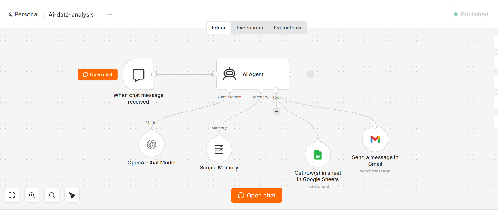

# AI-Powered Data Analysis & Reporting Automation

An AI-powered data analysis workflow built using n8n, OpenAI,
Google Sheets, and Gmail.

## Overview

This workflow allows users to interact with data using natural
language. The AI Agent receives a user's request, retrieves
relevant data from Google Sheets, processes the information,
and sends the analysis results through Gmail.

## Workflow

User
  ↓
Chat Trigger
  ↓
AI Agent
  ↓
OpenAI Chat Model
  ↓
Google Sheets
  ↓
Data Analysis
  ↓
Gmail
  ↓
Analysis Report

## Technologies Used

- n8n
- OpenAI API
- Google Sheets
- Gmail
- AI Agent
- Conversational Memory

## Key Features

- Natural-language data queries
- AI-assisted data analysis
- Google Sheets integration
- Conversational memory
- Automated email reporting
- End-to-end workflow automation

## Example Use Case

A user can ask:

"Which products have the highest sales?"

The AI Agent retrieves the relevant data from Google Sheets,
analyzes it, and generates a response.

The result can then be automatically sent to the user's email.

## Workflow Screenshot

## How It Works

1. The user submits a question through the chat trigger.
2. The AI Agent interprets the user's request.
3. The OpenAI model processes the request.
4. The agent retrieves the required information from Google Sheets.
5. The data is analyzed based on the user's question.
6. The result is generated in a readable format.
7. Gmail automatically sends the result to the user.

## Future Improvements

- Add visualization generation.
- Add support for multiple datasets.
- Add data cleaning and preprocessing.
- Add automated PDF reports.
- Add database integration such as PostgreSQL/MySQL.
